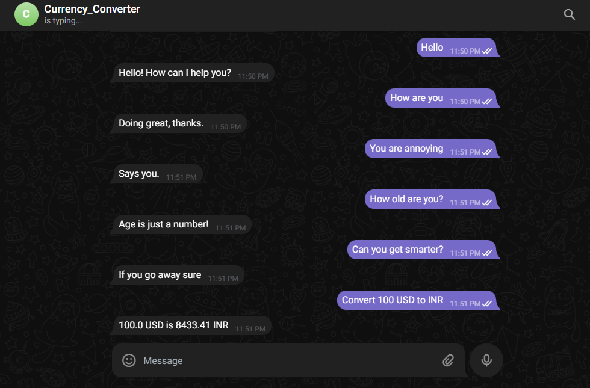
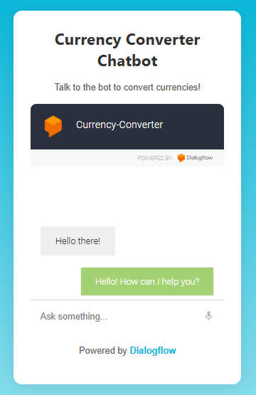
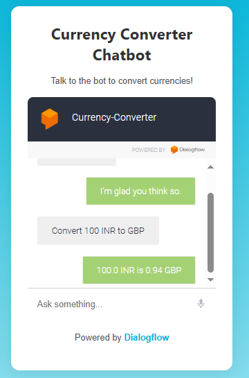
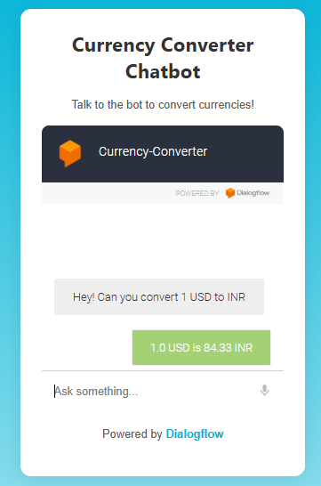

# Currency Converter Bot

## Overview
This project is a currency converter bot built using Dialogflow, Flask, and the Exchange Rate API. It allows users to convert amounts between different currencies through a chatbot interface available on Telegram and a website. The bot fetches live exchange rates using the Exchange Rate API and returns the converted amount.

## Features
- Conversational interface via Dialogflow
- Currency conversion using live exchange rates
- Available on Telegram and a web interface
- Built with Flask and ngrok for local testing

## Tech Stack
- **Backend**: Flask
- **Frontend**: HTML, CSS (for the web interface)
- **API**: Exchange Rate API, Dialogflow
- **Others**: ngrok (for local testing), Telegram Bot API

## Installation

1. Clone the repository:
   ```bash
   git clone https://github.com/yourusername/project-name.git
   cd project-name
   ```

2. Set up a virtual environment:
   ```bash
   python -m venv venv
   ```

3. Activate the virtual environment:
   - **Windows**:  
     ```bash
     venv\Scripts\activate
     ```
   - **macOS/Linux**:  
     ```bash
     source venv/bin/activate
     ```

4. Install dependencies:
   ```bash
   pip install -r requirements.txt
   ```

5. Set up API keys:
   - Get a Dialogflow credentials file and add it to your project.
   - Sign up for an [Exchange Rate API](https://www.exchangerate-api.com/) key and add it to the code.

6. Run the app:
   ```bash
   python app.py
   ```

Your Flask app should now be running locally at `http://127.0.0.1:5000`.

## Usage
- **Telegram**: Search for your bot and interact with it.
- **Website**: Visit your website to talk to the bot.

# Images Examples:




# Implemented in a Demo Website






